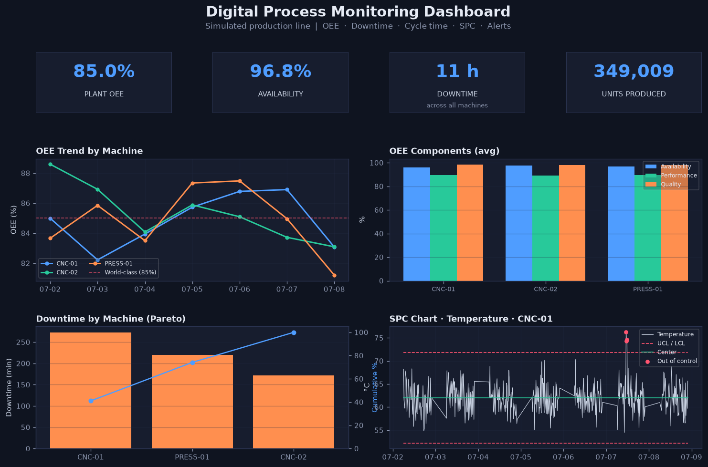

# Digital Process Monitoring Dashboard

A digital manufacturing dashboard that monitors a **simulated production line**,
tracking process KPIs, equipment performance, downtime and quality using
**Python, SQL, and Power BI**.

The project generates realistic sensor and production data, stores it in a SQL
database, computes core manufacturing analytics (OEE, downtime, cycle time, SPC)
in SQL, and visualises them in an interactive Power BI report.

---

## Power BI report


An interactive Power BI report built on the exported data: KPI cards, OEE trend
by machine, downtime Pareto, OEE component breakdown, an SPC control chart, and
a live alerts table with machine/date slicers that cross-filter every visual.

## Python-rendered dashboard

The pipeline also renders a standalone dashboard image, so the analytics can be
viewed without opening Power BI:



---

## Features

Sensors monitored: **temperature, pressure, motor current, flow rate,
energy consumption, production count**.

| Category | Metric |
|---|---|
| **OEE** | Availability x Performance x Quality, per machine per day |
| **Downtime** | Discrete stoppage events + Pareto (gaps-and-islands SQL) |
| **Cycle time** | Actual vs. ideal cycle time per hour, cycle-loss |
| **SPC** | Temperature control chart (mean +/- 3 sigma) with out-of-control flags |
| **Trend analysis** | Sensor + KPI trends across the production window |
| **Alerts** | Spec-limit breaches + SPC violations, exported as a table |

---

## Tech stack

- **Python** - data simulation, database loading, analytics, matplotlib dashboard
- **SQL (SQLite)** - schema + analytical views (OEE, downtime, cycle time, SPC)
- **Power BI** - interactive report built on the exported CSV feeds
- **Excel** - the CSV exports open directly for pivot/report use

> SQLite is used so the project runs with zero database setup. The SQL is
> standard and ports to Postgres/MySQL with minimal change.

---

## Quick start

```bash
pip install -r requirements.txt
python run_all.py
```

That runs the full pipeline:

```
generate_data  ->  load_database  ->  analytics  ->  dashboard
```

Outputs:
- `data/factory.db` - SQLite database with all views
- `exports/*.csv` - flat tables for Power BI / Excel
- `docs/dashboard.png` - rendered dashboard image

You can also run any stage on its own, e.g. `python src/analytics.py`.

To rebuild the Power BI report from the CSV feeds, follow
[`docs/POWERBI_GUIDE.md`](docs/POWERBI_GUIDE.md).

---

## Project structure

```
manufacturing-dashboard/
├── config.py              # all tunable parameters + DB connection helper
├── run_all.py             # one-command pipeline
├── requirements.txt
├── src/
│   ├── generate_data.py   # simulate sensor + production data
│   ├── load_database.py   # build SQLite DB + apply views
│   ├── analytics.py       # alerts engine + Power BI CSV exports
│   └── dashboard.py       # matplotlib dashboard (PNG)
├── sql/
│   ├── schema.sql         # fact table + indexes
│   ├── oee.sql            # OEE (availability/performance/quality)
│   ├── downtime.sql       # downtime events + summary (gaps & islands)
│   ├── cycle_time.sql     # actual vs ideal cycle time
│   └── spc.sql            # SPC control limits
├── exports/               # generated CSV feeds for Power BI / Excel
├── data/                  # generated CSV + SQLite database
└── docs/
    ├── powerbi_dashboard.png
    ├── dashboard.png
    └── POWERBI_GUIDE.md   # step-by-step Power BI build guide
```

---

## How the analytics work

**OEE** - one sensor row equals one minute, so minute counts map directly to
time. Availability = running minutes / planned minutes; Performance =
(ideal cycle time x units) / running seconds; Quality = good / total units.

**Downtime events** - a gaps-and-islands SQL pattern groups each contiguous run
of `DOWN` minutes into a single stoppage, giving true event counts and durations
rather than just total down-minutes.

**SPC** - control limits are the process mean +/- 3 sigma over healthy running
readings. Any point outside the band is flagged `out_of_control` and surfaced in
the alerts table.

The simulator deliberately injects **downtime blocks** and **sensor drift**
periods (a variable slowly leaving spec, raising the defect rate) so the OEE,
SPC and alert logic all have realistic signals to detect.

---

---

## License

Released under the MIT License - see [LICENSE](LICENSE).
